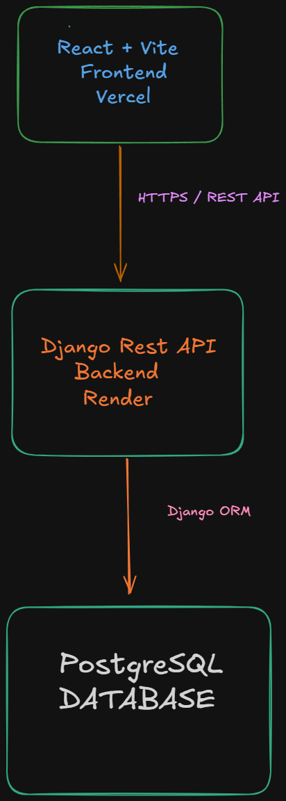
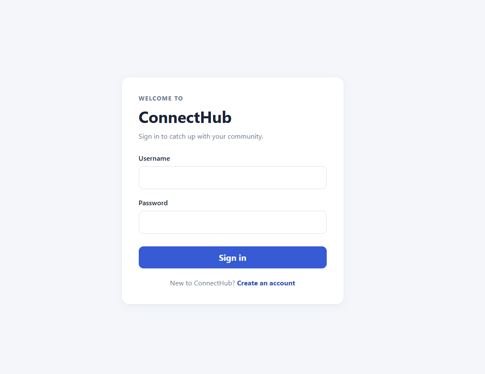
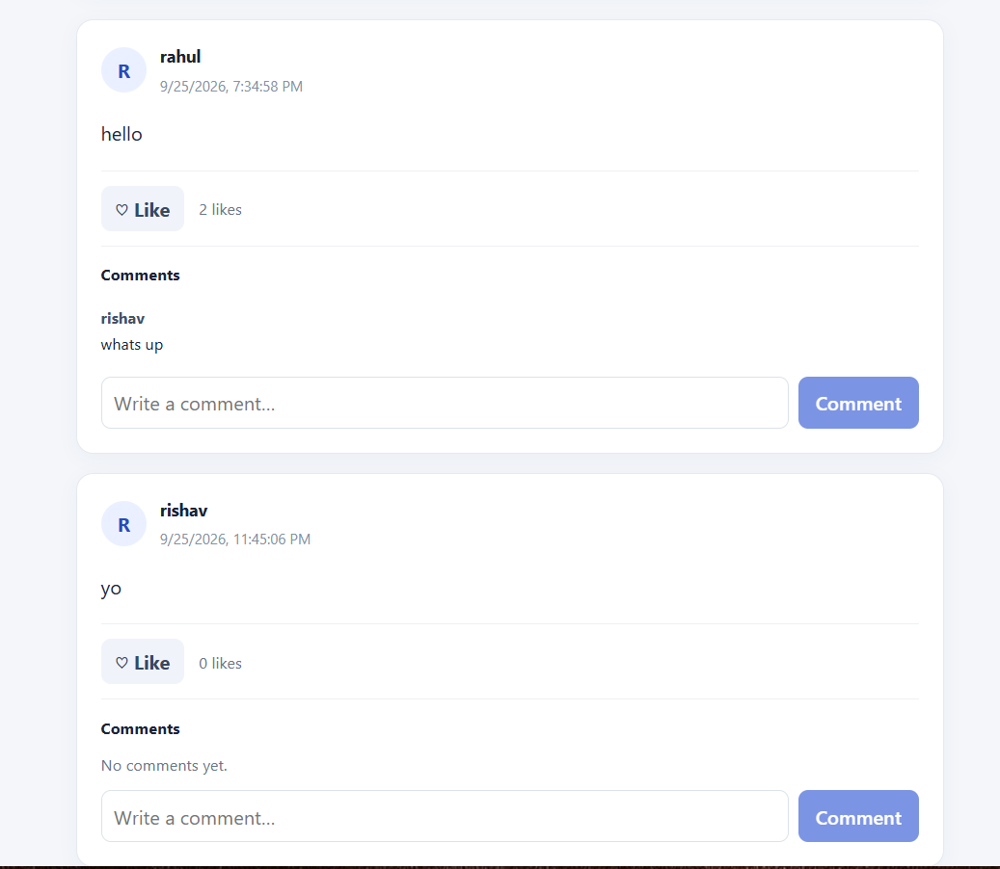
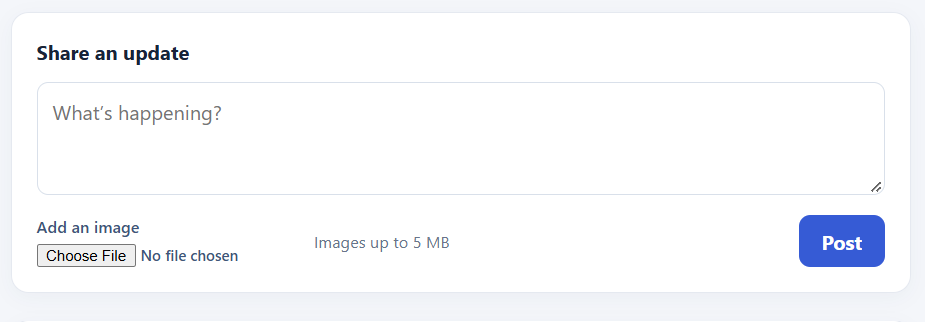
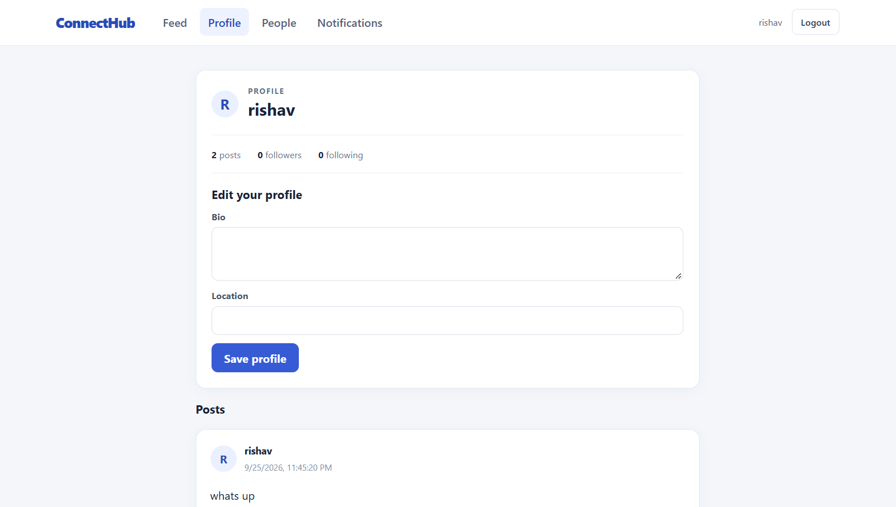
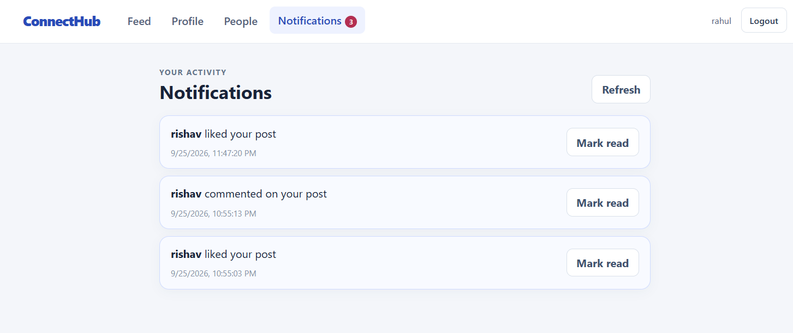

# ConnectHub

ConnectHub is a full-stack social networking application built with React, Django REST Framework, and PostgreSQL. It brings user profiles, posts, and social interactions together in a web application backed by a REST API.

## Live Demo

- Frontend: [https://connect-hub-pink-two.vercel.app/](https://connect-hub-pink-two.vercel.app/)
- Backend API: [https://connecthub-backend-3k3t.onrender.com/](https://connecthub-backend-3k3t.onrender.com/)
- Health endpoint: [https://connecthub-backend-3k3t.onrender.com/api/hello/](https://connecthub-backend-3k3t.onrender.com/api/hello/)

## Overview

ConnectHub lets people create accounts, maintain profiles, find and follow other users, and share updates. Signed-in users can browse a social feed, add images to posts, like and comment on posts, and receive notifications for follows, likes, and comments.

The React interface communicates with a Django REST Framework API. Django handles authentication and application logic, and uses the Django ORM to access the database.

## Features

- User registration, login, and logout
- Session-based authentication with CSRF-protected state-changing requests
- User profiles with editable bio and location
- Search for people by username, name, or email
- Follow and unfollow users
- Social feed and post creation
- Image uploads on posts
- Like and unlike posts
- Add comments to posts
- Notifications for follows, likes, and comments, with read status
- REST API for frontend and backend communication

## Tech Stack

### Frontend

- React
- Vite
- JavaScript

### Backend

- Python
- Django
- Django REST Framework
- Django REST Framework Session Authentication

### Database

- SQLite for local development
- PostgreSQL in production
- Django ORM for database access

### Deployment

- Vercel for the frontend
- Render for the backend

## Architecture



In production, the request path is:

React + Vite frontend → HTTPS / REST API → Django REST Framework backend → Django ORM → PostgreSQL

1. A user action in the React app sends an HTTPS request to the backend REST API.
2. Django REST Framework applies authentication and handles the API request and application logic.
3. Django ORM reads or updates application data in PostgreSQL.
4. The backend returns a response that the frontend uses to update the interface.

## Security & Authentication

- The API uses Django session-based authentication.
- The frontend retrieves a CSRF token from the backend before state-changing requests.
- State-changing requests send the token in the `X-CSRFToken` header and include browser cookies with `credentials: include`.
- A centralized frontend API helper handles credentials, CSRF token retrieval, and requests.
- CORS allowed origins and CSRF trusted origins are configured through environment variables.
- The production configuration uses secure cookies with `SameSite=None` for cross-origin frontend and backend requests.
- Secret settings are read from environment variables rather than documented values in this repository.
- `DEBUG` defaults to false and should remain `False` in production.

## Backend & API

The Django and Django REST Framework backend provides account registration and authentication, profile and people search endpoints, social interactions, notifications, and post operations. API views validate requests and serialize response data; the Django ORM handles database access.

The application models include:

- `User`: custom Django user model with a unique email address
- `Profile`: a user's bio and location
- `Follow`: a follower-to-followed-user relationship
- `Post`: text content, author, timestamp, and optional image
- `Like`: a user's like on a post
- `Comment`: text comment on a post
- `Notification`: follow, like, or comment activity and read status

The health endpoint is `GET /api/hello/`. It returns:

```json
{
  "message": "connecthub"
}
```

## Local Development

### Prerequisites

- Python 3
- Node.js and npm
- Git

Clone the repository:

```bash
git clone https://github.com/RishavAry/ConnectHub.git
cd ConnectHub
```

### Backend

Create and activate a Python virtual environment, install the backend requirements, apply migrations, and start Django:

```bash
python -m venv .venv
source .venv/bin/activate
pip install -r requirements.txt
python manage.py migrate
python manage.py runserver
```

On Windows, activate the environment with `.venv\Scripts\activate`.

### Frontend

In a second terminal, install the frontend dependencies and start the Vite development server:

```bash
cd frontend
npm install
npm run dev
```

The frontend reads the backend base URL from `VITE_API_BASE_URL`. For a local backend, set it to `http://localhost:8000` in the frontend environment. The frontend falls back to this URL when the variable is not set.

Local development uses SQLite by default. Production uses PostgreSQL. Configure backend settings such as `SECRET_KEY`, `DEBUG`, `ALLOWED_HOSTS`, `DATABASE_URL`, `CORS_ALLOWED_ORIGINS`, and `CSRF_TRUSTED_ORIGINS` through environment variables as appropriate for your environment. Do not put secret values in source control.

## Demo

- [Live frontend](https://connect-hub-pink-two.vercel.app/)
- [Backend API](https://connecthub-backend-3k3t.onrender.com/)
- [Health endpoint](https://connecthub-backend-3k3t.onrender.com/api/hello/)

## Screenshots

### Login



### Feed



### Create Post



### Profile



### Notifications



## Project Structure

```text
ConnectHub/
├── accounts/             # Django app: models, API views, serializers, and routes
├── config/               # Django project settings and root URL configuration
├── docs/
│   ├── architecture.png
│   └── screenshots/
├── frontend/             # React + Vite application
├── manage.py
├── requirements.txt
└── README.md
```

## Deployment

- Frontend: Vercel
- Backend: Render
- Production database: PostgreSQL

Image upload is implemented in the application. Persistent production media storage is still a future improvement.

## Project Status

ConnectHub is deployed, and its core application features are demonstrable through the live frontend and backend.

## Future Improvements

- Add persistent production media storage
- Expand automated test coverage
- Publish API documentation
- Add Redis caching and background jobs
- Add Docker-based development and deployment support
- Add CI/CD workflows
- Improve API and frontend performance as usage grows
